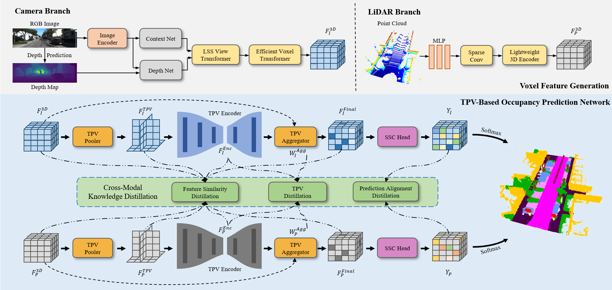
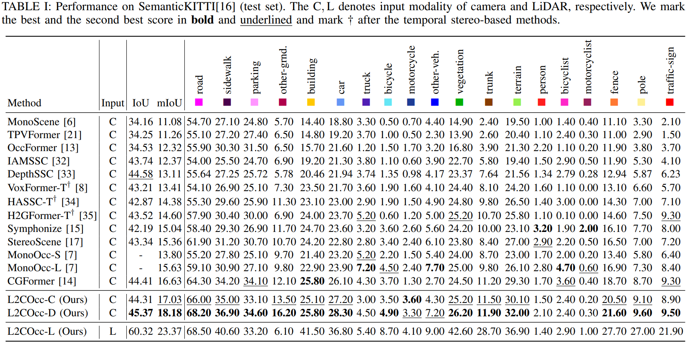
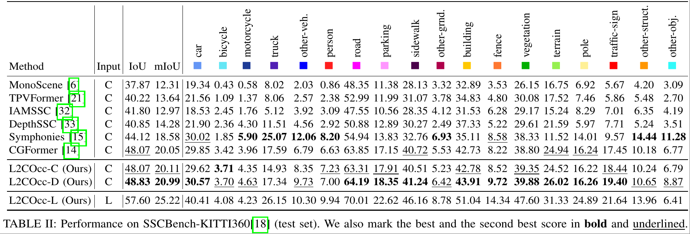

# L2COcc: Lightweight Camera-Centric Semantic Scene Completion via Distillation of LiDAR Model

<!-- ## 🚀 News

- **2025.x.xx** code released
- **2024.x.xx** [**arXiv**](https://arxiv.org/abs/2405.13675) preprint released -->

## Introduction

Semantic Scene Completion (SSC) constitutes a
pivotal element in autonomous driving perception systems,
tasked with inferring the 3D semantic occupancy of a scene
from sensory data. To improve accuracy, prior research has
implemented various computationally demanding and memory-
intensive 3D operations, imposing significant computational
requirements on the platform during training and testing. This
paper proposes L2COcc, a lightweight camera-centric SSC
framework that also accommodates LiDAR inputs. With our
proposed efficient voxel transformer (EVT) and cross-modal
knowledge modules, including feature similarity distillation
(FSD), TPV distillation (TPVD) and prediction alignment dis-
tillation (PAD), our method substantially reduce computational
burden while maintaining high accuracy. The experimental
evaluations demonstrate that our proposed method surpasses
the current state-of-the-art vision-based SSC methods regarding
accuracy on both the SemanticKITTI and SSCBench-KITTI-
360 benchmarks, respectively. Additionally, our method is more
lightweight, exhibiting a reduction in both memory consump-
tion and inference time by over 23% compared to the current
state-of-the-arts method.

## Video Demonstration


More video demonstrations can be found at the [project page](https://studyingfufu.github.io/L2COcc/).


## Method



The overall framework of our proposed L2COcc, comprised of three stages: voxel feature generation (indicated by the gray background), TPV-based occupancy prediction network (indicated by the blue background), and cross-modal knowledge distillation (indicated by the green background).

## Quantitative Results





## Getting Started

step 1. Refer to [install.md](./docs/install.md) to install the environment.

step 2. Refer to [dataset.md](./docs/dataset.md) to prepare SemanticKITTI and KITTI360 dataset.

step 3. Refer to [train_and_eval.md](./docs/train_and_eval.md) for training and evaluation.

step 4. Refer to [visualization.md](./docs/visualization.md) for visualizations.

## Results
1. SemanticKITTI
     Model | Sensor | Split | IoU | mIoU | Download |
    | :---: | :---: | :---: | :---: | :---: | :---: |
    | L2COcc-c | Camera | val  | 45.56 | 16.72 | [ckpt](https://github.com/StudyingFuFu/L2COcc/releases/download/v1.0/l2cocc_c_semantickitti_1672_4556.ckpt)/[log](https://github.com/StudyingFuFu/L2COcc/releases/download/v1.0/l2cocc_c_semantickitti_val.txt)|
    | L2COcc-c | Camera | test | 44.31 | 17.03 | [output](https://github.com/StudyingFuFu/L2COcc/releases/download/v1.0/l2cocc_c_semantickitti_test.txt)|
    | L2COcc-d | Camera | val  | 45.30 | 18.22 | [ckpt](https://github.com/StudyingFuFu/L2COcc/releases/download/v1.0/l2cocc_d_semantickitti_1822_4530.ckpt)/[log](https://github.com/StudyingFuFu/L2COcc/releases/download/v1.0/l2cocc_d_semantickitti_val.txt)|
    | L2COcc-d | Camera | test | 45.37 | 18.18 | [output](https://github.com/StudyingFuFu/L2COcc/releases/download/v1.0/l2cocc_d_semantickitti_test.txt)|
    | L2COcc-l | LiDAR  | val  | 60.66 | 24.21 | [ckpt](https://github.com/StudyingFuFu/L2COcc/releases/download/v1.0/l2cocc_l_semantickitti_2421_6066.ckpt)/[log](https://github.com/StudyingFuFu/L2COcc/releases/download/v1.0/l2cocc_l_semantickitti_val.txt)|
    | L2COcc-l | LiDAR  | test | 60.32 | 23.37 | [output](https://github.com/StudyingFuFu/L2COcc/releases/download/v1.0/l2cocc_l_semantickitti_test.txt)|

2. KITTI360
     Model | Sensor | Split | IoU | mIoU | Download |
    | :---: | :---: | :---: | :---: | :---: | :---: |
    | L2COcc-c | Camera | test  | 48.07 | 20.11 | [ckpt](https://github.com/StudyingFuFu/L2COcc/releases/download/v1.0/l2cocc_c_kitti360_2011_4807.ckpt)/[log](https://github.com/StudyingFuFu/L2COcc/releases/download/v1.0/l2cocc_c_kitti360_test.txt)|
    | L2COcc-d | Camera | test  | 48.83 | 20.99 | [ckpt](https://github.com/StudyingFuFu/L2COcc/releases/download/v1.0/l2cocc_d_kitti360_2099_4883.ckpt)/[log](https://github.com/StudyingFuFu/L2COcc/releases/download/v1.0/l2cocc_d_kitti360_test.txt)|
    | L2COcc-l | LiDAR  | test  | 57.60 | 25.22 | [ckpt](https://github.com/StudyingFuFu/L2COcc/releases/download/v1.0/l2cocc_l_kitti360_2521_5760.ckpt)/[log](https://github.com/StudyingFuFu/L2COcc/releases/download/v1.0/l2cocc_l_kitti360_test.txt)|

## Acknowledgement

Many thanks to these exceptional open source projects:
- [CGFormer](https://github.com/pkqbajng/CGFormer)
- [LiCROcc](https://github.com/HR-zju/LiCROcc)
- [PointOcc](https://github.com/wzzheng/PointOcc)
- [BEVFormer](https://github.com/fundamentalvision/BEVFormer)
- [mmdet3d](https://github.com/open-mmlab/mmdetection3d)
- [MonoScene](https://github.com/astra-vision/MonoScene)
- [semantic-kitti-api](https://github.com/PRBonn/semantic-kitti-api) 
- [MobileStereoNet](https://github.com/cogsys-tuebingen/mobilestereonet)
- [Symphonize](https://github.com/hustvl/Symphonies.git)
- [DFA3D](https://github.com/IDEA-Research/3D-deformable-attention.git)
- [VoxFormer](https://github.com/NVlabs/VoxFormer.git)

<!-- As it is not possible to list all the projects of the reference papers. If you find we leave out your repo, please contact us and we'll update the lists. -->

## Bibtex

If you find our work beneficial for your research, please consider citing our paper and give us a star:

```
@misc{wang2025l2cocclightweightcameracentricsemantic,
      title={L2COcc: Lightweight Camera-Centric Semantic Scene Completion via Distillation of LiDAR Model}, 
      author={Ruoyu Wang and Yukai Ma and Yi Yao and Sheng Tao and Haoang Li and Zongzhi Zhu and Yong Liu and Xingxing Zuo},
      year={2025},
      eprint={2503.12369},
      archivePrefix={arXiv},
      primaryClass={cs.CV},
      url={https://arxiv.org/abs/2503.12369}, 
}
```

If you encounter any issues, please contact samuraiwry@gmail.com.


