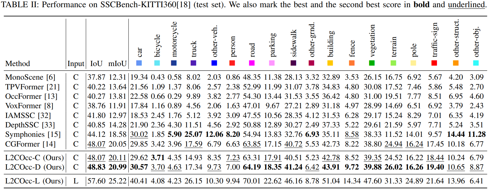

# L2COcc: Lightweight Camera-Centric Semantic Scene Completion via Distillation of LiDAR Model

<!-- ## 🚀 News

- **2025.x.xx** code released
- **2024.x.xx** [**arXiv**](https://arxiv.org/abs/2405.13675) preprint released -->

## Introduction

Scene Semantic Completion (SSC) constitutes a pivotal element in autonomous driving perception systems, tasked with inferring the 3D semantic occupancy of a scene from sensory data.
To improve accuracy, prior research has implemented various computationally demanding and memory-intensive 3D operations, imposing significant computational requirements on the platform during training and testing.
This paper proposes {\methodname}, a lightweight camera-centric SSC framework that also accommodates LiDAR inputs.
With our proposed efficient voxel transformer (EVT) and three types of cross-modal knowledge modules (FSD, TPVD, PAD), our method substantially reduce computational burden while maintaining high accuracy.
The experimental evaluations demonstrate that our proposed method surpasses the current state-of-the-art vision-based SSC methods regarding accuracy on both the SemanticKITTI and SSCBench-KITTI-360 benchmarks, respectively. Additionally, our method is more lightweight, exhibiting a reduction in both memory consumption and inference time by over 25\%.

## Method


The overall framework of our proposed L2COcc, comprised of three stages: voxel feature generation (indicated by the gray background}), TPV-based occupancy prediction network (indicated by the blue background}), and cross-modal knowledge distillation (indicated by the green background}).

## Quantitative Results




## Getting Started

step 1. Refer to [install.md](./docs/install.md) to install the environment.

step 2. Refer to [dataset.md](./docs/dataset.md) to prepare SemanticKITTI and KITTI360 dataset.

step 3. Refer to [train_and_eval.md](./docs/train_and_eval.md) for training and evaluation.

## Acknowledgement

Many thanks to these exceptional open source projects:
- [BEVFormer](https://github.com/fundamentalvision/BEVFormer)
- [mmdet3d](https://github.com/open-mmlab/mmdetection3d)
- [MonoScene](https://github.com/astra-vision/MonoScene)
- [semantic-kitti-api](https://github.com/PRBonn/semantic-kitti-api) 
- [MobileStereoNet](https://github.com/cogsys-tuebingen/mobilestereonet)
- [Symphonize](https://github.com/hustvl/Symphonies.git)
- [DFA3D](https://github.com/IDEA-Research/3D-deformable-attention.git)
- [VoxFormer](https://github.com/NVlabs/VoxFormer.git)

As it is not possible to list all the projects of the reference papers. If you find we leave out your repo, please contact us and we'll update the lists.

## Bibtex

If you find our work beneficial for your research, please consider citing our paper and give us a star:

```
```

If you encounter any issues, please contact samuraiwry@gmail.com.

## To do

- Create a Model Zoo
- Visualization scripts

